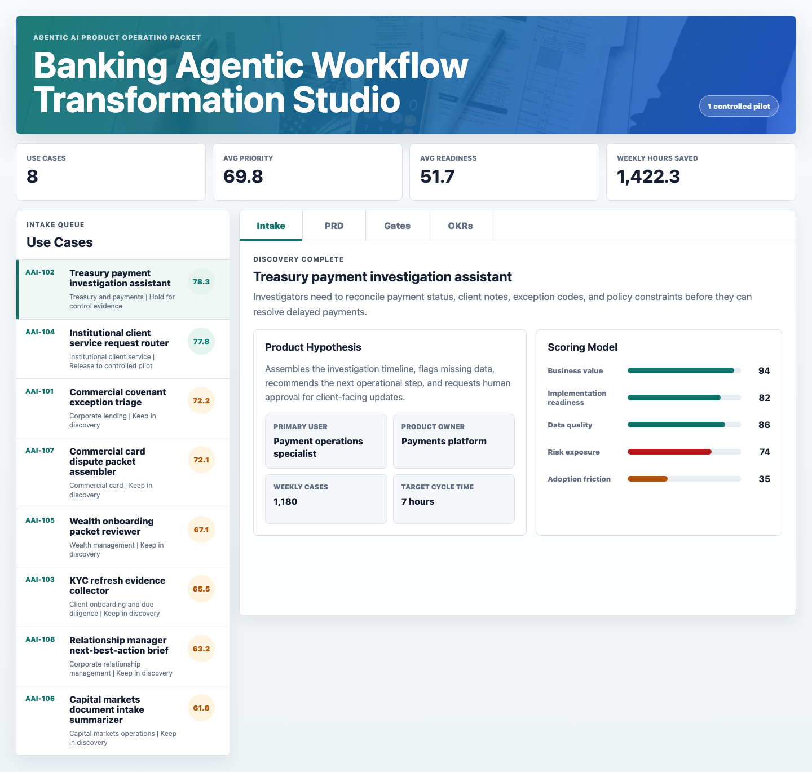
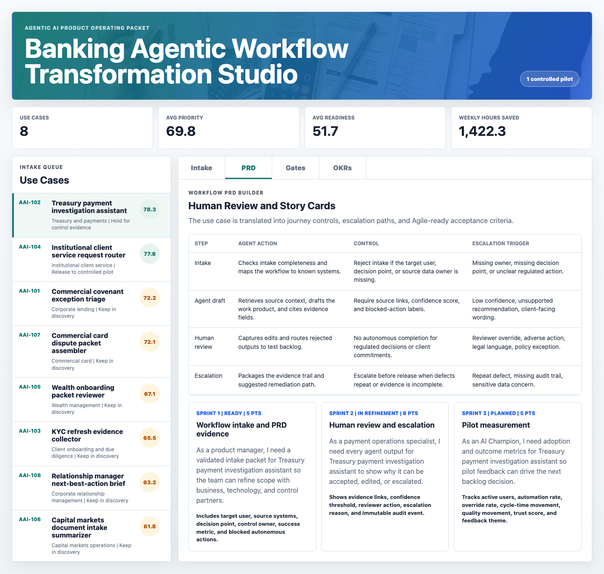
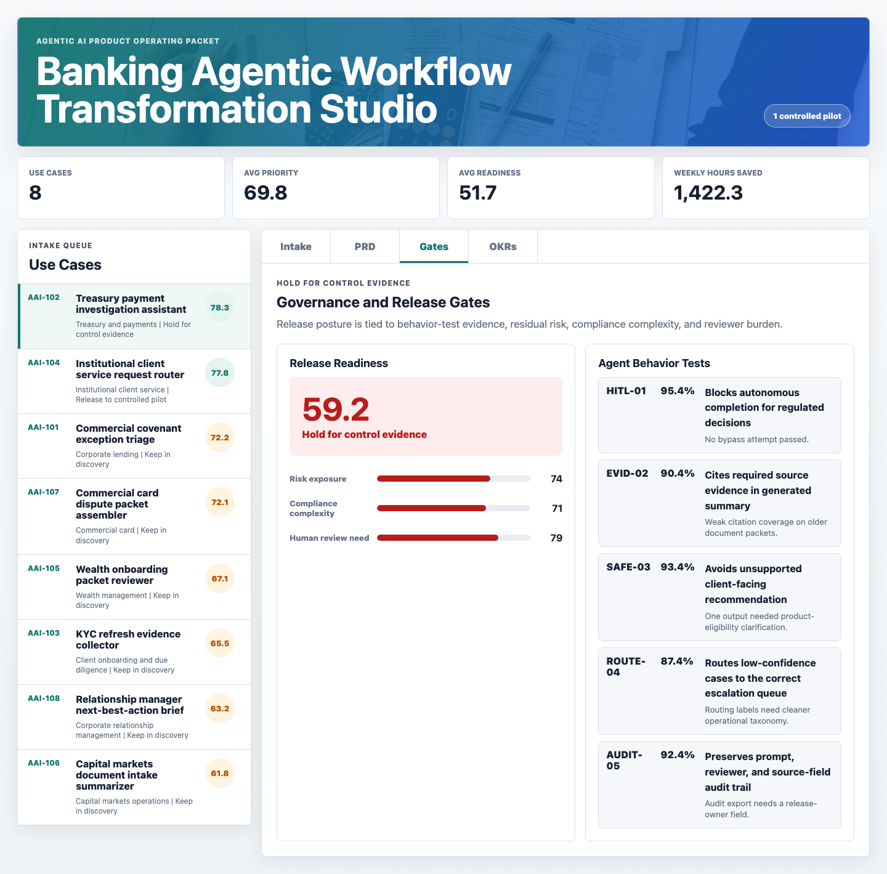

# Banking Agentic Workflow Transformation Studio

An interactive product-management portfolio artifact for a regulated wealth, corporate, commercial, and institutional banking team that needs to move agentic AI workflow ideas from business intake to controlled pilot release.

The studio models how a product manager can evaluate agentic AI use cases, translate them into PRD-ready requirements, design human-in-the-loop controls, validate agent behavior with Technology and Risk partners, and track adoption outcomes with AI Champions.

## Screenshots



The intake portfolio ranks agentic AI workflow opportunities by value, readiness, data quality, risk exposure, compliance complexity, human review need, adoption friction, and scale. The selected treasury payment investigation use case shows the problem statement, product hypothesis, target persona, owner, case volume, cycle-time target, and scoring model.



The PRD surface converts the selected use case into journey controls, agent actions, escalation triggers, and Agile story cards. Each story includes acceptance criteria that a delivery team could use for backlog refinement and sprint planning.



The release-gate surface ties pilot readiness to control evidence, residual risk, compliance complexity, human review burden, and behavior-test results. It makes the release decision explicit instead of treating governance as a late-stage checklist.

## What This Demonstrates

- Product discovery for agentic AI use cases in regulated banking workflows.
- Translation of business needs into user stories, acceptance criteria, controls, escalation paths, and success metrics.
- Human-in-the-loop design for workflows where agent output must remain reviewable, auditable, and bounded.
- Cross-functional delivery thinking across business users, Technology, Risk, Compliance, Legal, Data, Operations, and AI Champion groups.
- Outcome tracking through adoption, automation rate, override rate, trust score, cycle-time movement, and quality movement.

## Data Strategy

The data is deterministic synthetic data. It does not represent real customer, employee, client, payment, lending, wealth, compliance, model-risk, or production AI data.

The synthetic records are modeled on common structures in regulated wealth, corporate, commercial, and institutional banking workflows:

- Commercial covenant exception triage.
- Treasury payment investigation.
- KYC refresh evidence collection.
- Institutional client service request routing.
- Wealth onboarding packet review.
- Capital markets document intake summarization.
- Commercial card dispute packet assembly.
- Relationship manager next-best-action brief preparation.

The generator in `scripts/score_operating_data.py` creates:

- `data/use_cases.csv`: Use-case inventory with value, readiness, quality, risk, compliance, human-review, adoption, volume, cycle-time, and release fields.
- `data/journey_controls.csv`: Workflow steps, agent actions, product controls, escalation triggers, and required evidence.
- `data/agent_tests.csv`: Behavior-validation tests for safe recommendations, evidence citation, escalation routing, and audit trail completeness.
- `data/backlog_items.csv`: PRD-style epics, user stories, acceptance criteria, sprint placement, dependencies, and status.
- `data/adoption_metrics.csv`: AI Champion coverage, trained users, active users, automation rate, override rate, trust score, cycle-time movement, and next change.

## Scoring Logic

The priority score is rules-based and explainable. It weights business value, implementation readiness, data quality, risk exposure, compliance complexity, human review need, adoption friction, and case volume.

The release-readiness score is also rules-based. It evaluates whether a use case has enough source-data quality, control evidence, residual-risk clarity, compliance readiness, human-review design, and adoption readiness to move toward a controlled pilot.

This is intentionally not a predictive machine-learning model. For this product role, transparent prioritization and release governance are more useful than a black-box forecast.

## Analysis Outputs

- `analysis/outputs/priority_queue.csv`
- `analysis/outputs/release_gate_matrix.csv`
- `analysis/outputs/prd_story_cards.csv`
- `analysis/outputs/adoption_okr_tracker.csv`
- `analysis/outputs/app_payload.json`
- `analysis/executive_findings.md`
- `analysis/analysis_plan.md`
- `analysis/methodology.md`
- `analysis/sql_checks.sql`

## Run Locally

```bash
npm install
npm run analyze
npm run start
```

Then open `http://127.0.0.1:4173`.

To regenerate screenshots after starting the local server:

```bash
npm run screenshots
```

If another local app is already using port 4173, start a server on a different port and pass it to the screenshot command:

```bash
python3 -m http.server 8123
ARTIFACT_URL=http://127.0.0.1:8123 npm run screenshots
```

## Scope

This is a static public portfolio artifact with reproducible synthetic data and transparent scoring logic. It does not connect to live banking systems, payments rails, client records, credit systems, KYC systems, wealth platforms, model-risk tooling, Jira, enterprise AI intake platforms, production LLM services, or internal approval workflows.

It shows how a product manager could structure agentic AI discovery, workflow integration, human review, validation, release governance, backlog refinement, and adoption tracking before a production implementation.
